# ENTRY-F1 implementation screenshots

**READY FOR REVIEW** — actual disposable DB/API browser evidence, not approved design references.

Implementation: codex/entry-f1 @ 83a2e82b01610d2d9e1967b314f05bfd93331474. 32 PNG captures. Desktop viewport 1440×1000; mobile 390×844. Full-page image dimensions may exceed viewport height. Fixed navigation remains at its actual viewport position in full-page captures; it is not removed for evidence.

## ordinary-login-desktop

Ordinary entry; no Goal required

Route: /login. Actor: anonymous. Viewport: 1440×1000. PNG: 1440×1000. Commit: 83a2e82b01610d2d9e1967b314f05bfd93331474.

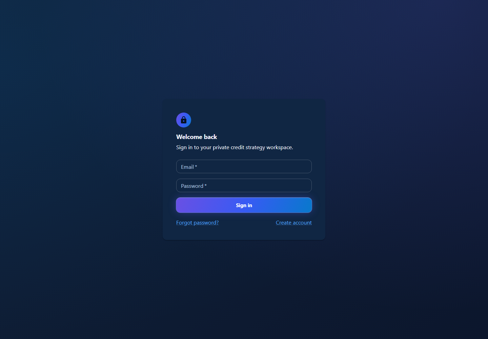

## ordinary-login-mobile

Ordinary entry; no Goal required

Route: /login. Actor: anonymous. Viewport: 390×844. PNG: 390×844. Commit: 83a2e82b01610d2d9e1967b314f05bfd93331474.

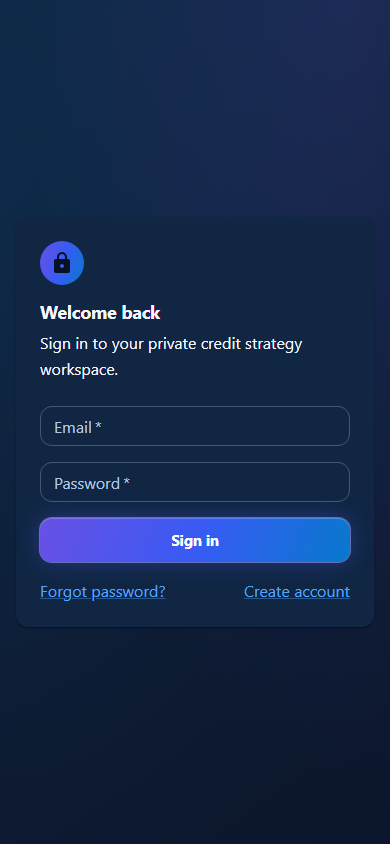

## ordinary-registration-desktop

Ordinary account creation without a Goal

Route: /register. Actor: anonymous. Viewport: 1440×1000. PNG: 1440×1000. Commit: 83a2e82b01610d2d9e1967b314f05bfd93331474.

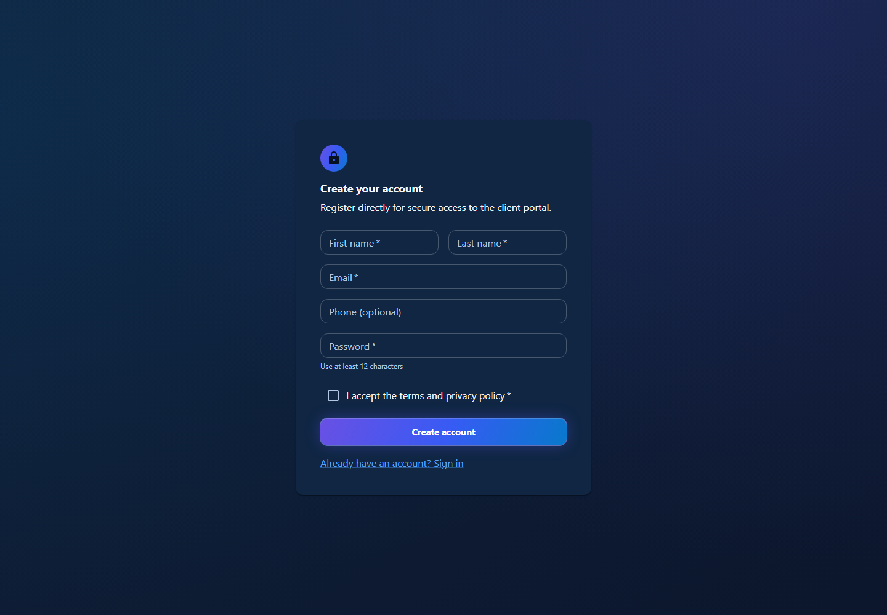

## ordinary-registration-mobile

Ordinary account creation without a Goal

Route: /register. Actor: anonymous. Viewport: 390×844. PNG: 390×844. Commit: 83a2e82b01610d2d9e1967b314f05bfd93331474.

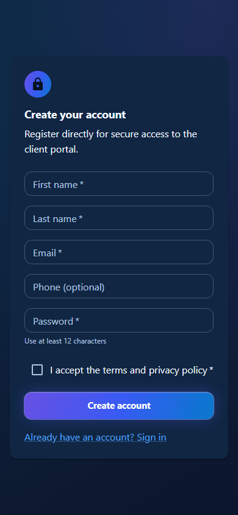

## public-saved-desktop

Saved draft with actual expiry and full summary

Route: /goal-intake. Actor: anonymous. Viewport: 1440×1000. PNG: 1440×1000. Commit: 83a2e82b01610d2d9e1967b314f05bfd93331474.

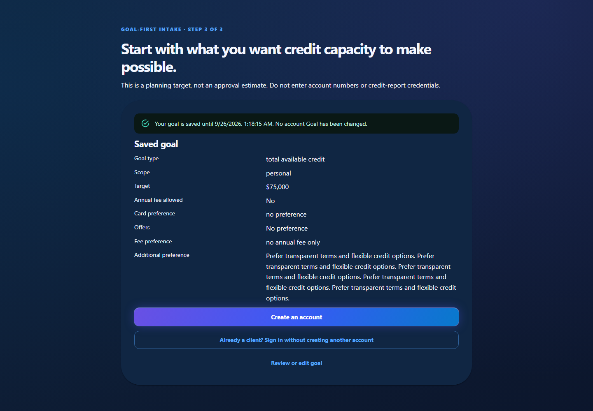

## public-saved-mobile

Saved draft with actual expiry and full summary

Route: /goal-intake. Actor: anonymous. Viewport: 390×844. PNG: 390×1313. Commit: 83a2e82b01610d2d9e1967b314f05bfd93331474.

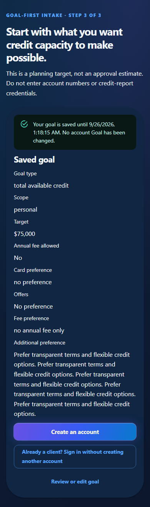

## register-with-goal-desktop

Optional saved draft; no application during signup

Route: /register?intake=%5Bredacted%5D. Actor: anonymous. Viewport: 1440×1000. PNG: 1440×1379. Commit: 83a2e82b01610d2d9e1967b314f05bfd93331474.

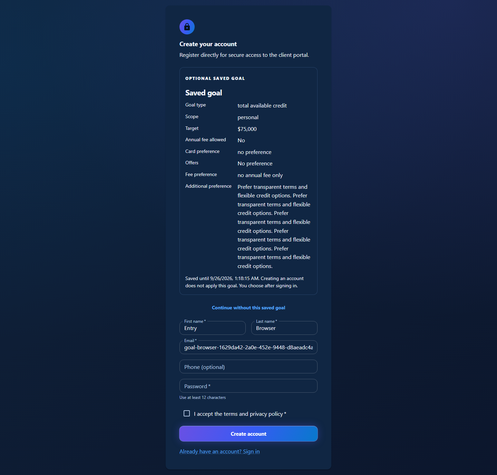

## register-with-goal-mobile

Optional saved draft; no application during signup

Route: /register?intake=%5Bredacted%5D. Actor: anonymous. Viewport: 390×844. PNG: 390×1543. Commit: 83a2e82b01610d2d9e1967b314f05bfd93331474.

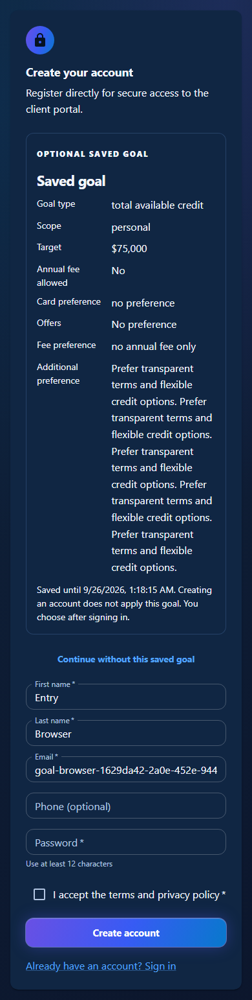

## pending-intake-desktop

Own attached draft remains discoverable after Not now

Route: /app/goals. Actor: 8fb3b2fd-1f30-4564-8ef7-5375acafd6fc. Viewport: 1440×1000. PNG: 1440×1000. Commit: 83a2e82b01610d2d9e1967b314f05bfd93331474.

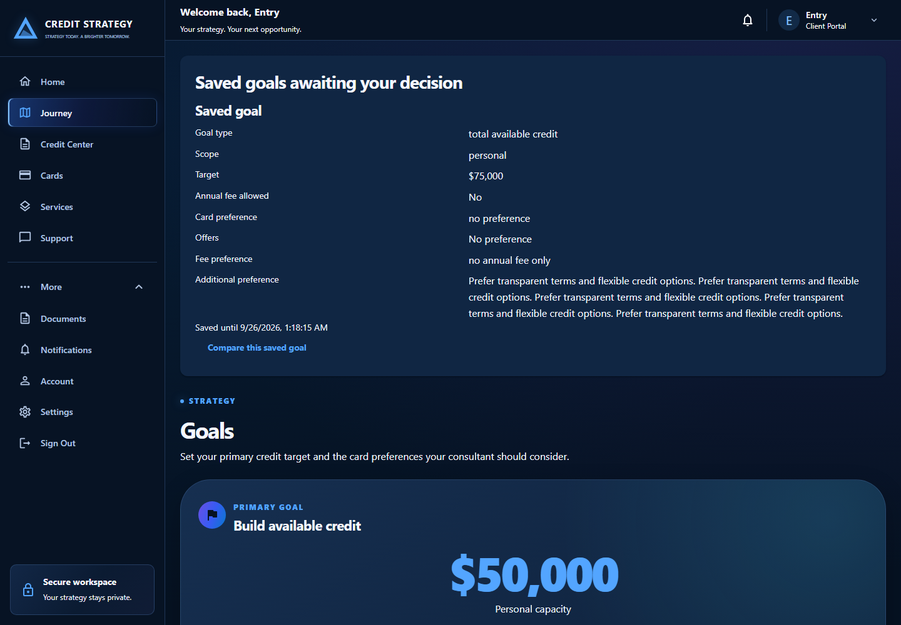

## pending-intake-mobile

Own attached draft remains discoverable after Not now

Route: /app/goals. Actor: 8fb3b2fd-1f30-4564-8ef7-5375acafd6fc. Viewport: 390×844. PNG: 390×2247. Commit: 83a2e82b01610d2d9e1967b314f05bfd93331474.

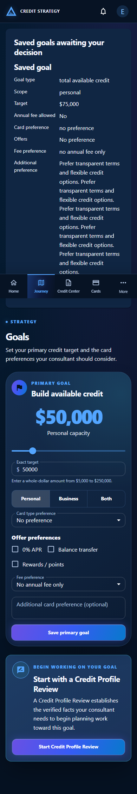

## decision-no-primary-desktop

Authenticated explicit decision, no current primary

Route: /app/goals?intakeClaim=%5Bredacted%5D. Actor: 8fb3b2fd-1f30-4564-8ef7-5375acafd6fc. Viewport: 1440×1000. PNG: 1440×1000. Commit: 83a2e82b01610d2d9e1967b314f05bfd93331474.

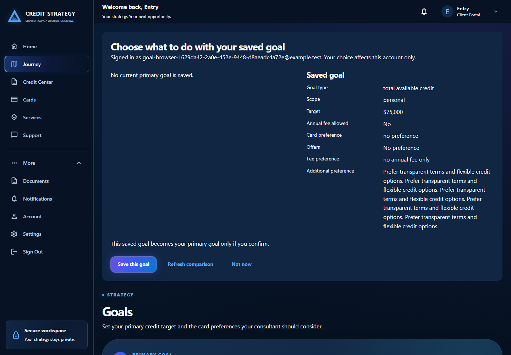

## decision-no-primary-mobile

Authenticated explicit decision, no current primary

Route: /app/goals?intakeClaim=%5Bredacted%5D. Actor: 8fb3b2fd-1f30-4564-8ef7-5375acafd6fc. Viewport: 390×844. PNG: 390×2608. Commit: 83a2e82b01610d2d9e1967b314f05bfd93331474.

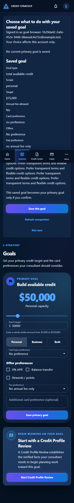

## applied-desktop

Server-confirmed Goal resolution

Route: /app/goals?intakeClaim=%5Bredacted%5D. Actor: 8fb3b2fd-1f30-4564-8ef7-5375acafd6fc. Viewport: 1440×1000. PNG: 1440×1000. Commit: 83a2e82b01610d2d9e1967b314f05bfd93331474.

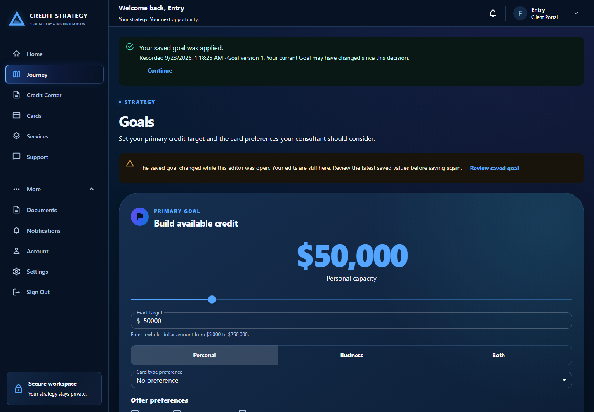

## applied-mobile

Server-confirmed Goal resolution

Route: /app/goals?intakeClaim=%5Bredacted%5D. Actor: 8fb3b2fd-1f30-4564-8ef7-5375acafd6fc. Viewport: 390×844. PNG: 390×1912. Commit: 83a2e82b01610d2d9e1967b314f05bfd93331474.

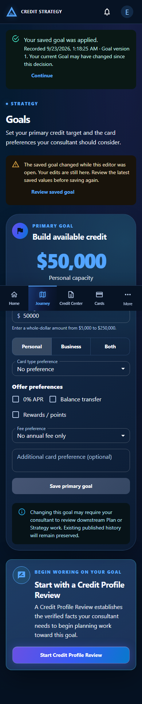

## decision-different-desktop

Current and saved Goal comparison

Route: /app/goals?intake=%5Bredacted%5D. Actor: 8fb3b2fd-1f30-4564-8ef7-5375acafd6fc. Viewport: 1440×1000. PNG: 1440×1000. Commit: 83a2e82b01610d2d9e1967b314f05bfd93331474.

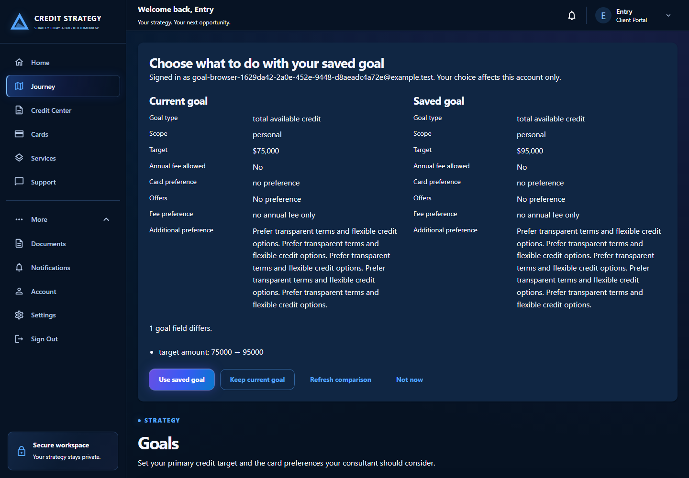

## decision-different-mobile

Current and saved Goal comparison

Route: /app/goals?intake=%5Bredacted%5D. Actor: 8fb3b2fd-1f30-4564-8ef7-5375acafd6fc. Viewport: 390×844. PNG: 390×3571. Commit: 83a2e82b01610d2d9e1967b314f05bfd93331474.

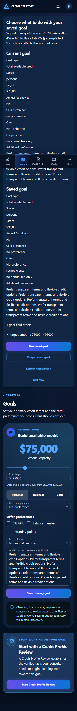

## kept-desktop

Server-confirmed Keep with unchanged Goal version

Route: /app/goals?intake=%5Bredacted%5D. Actor: 8fb3b2fd-1f30-4564-8ef7-5375acafd6fc. Viewport: 1440×1000. PNG: 1440×1000. Commit: 83a2e82b01610d2d9e1967b314f05bfd93331474.

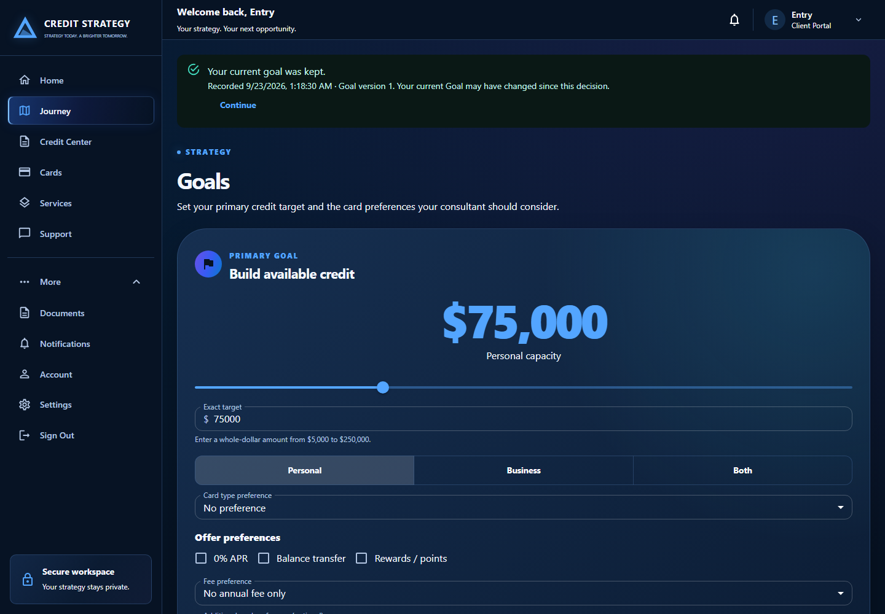

## kept-mobile

Server-confirmed Keep with unchanged Goal version

Route: /app/goals?intake=%5Bredacted%5D. Actor: 8fb3b2fd-1f30-4564-8ef7-5375acafd6fc. Viewport: 390×844. PNG: 390×1868. Commit: 83a2e82b01610d2d9e1967b314f05bfd93331474.

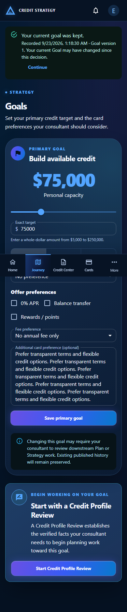

## public-stale-desktop

Second tab rejected at loaded revision; edits retained

Route: /goal-intake?intake=%5Bredacted%5D. Actor: public capability. Viewport: 1440×1000. PNG: 1440×1000. Commit: 83a2e82b01610d2d9e1967b314f05bfd93331474.

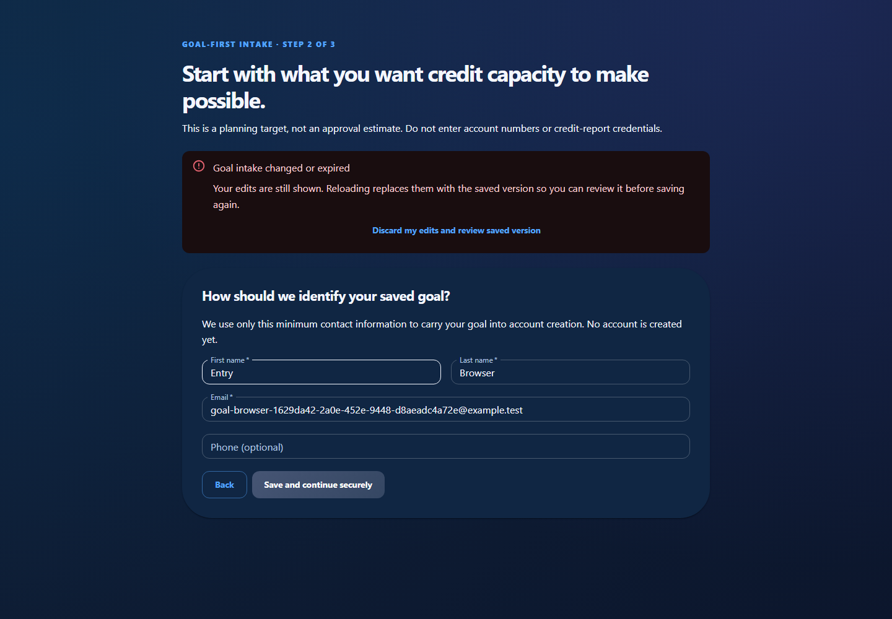

## public-stale-mobile

Second tab rejected at loaded revision; edits retained

Route: /goal-intake?intake=%5Bredacted%5D. Actor: public capability. Viewport: 390×844. PNG: 390×1020. Commit: 83a2e82b01610d2d9e1967b314f05bfd93331474.

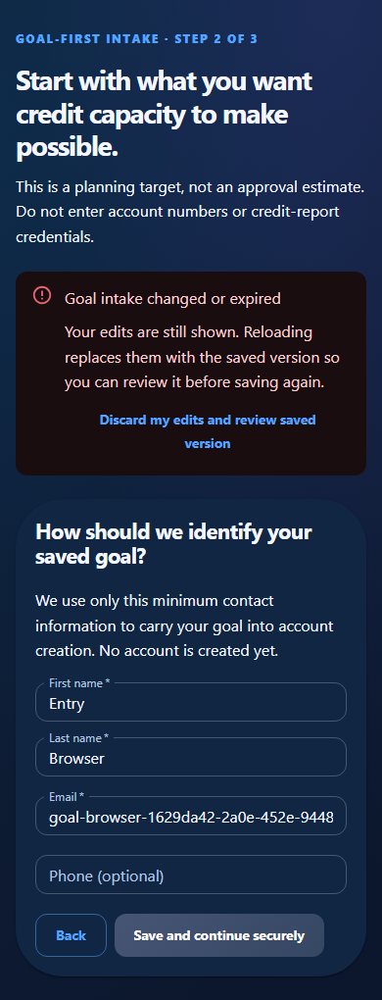

## decision-stale-desktop

Concurrent canonical edit requires a fresh explicit comparison

Route: /app/goals?intake=%5Bredacted%5D. Actor: 8fb3b2fd-1f30-4564-8ef7-5375acafd6fc. Viewport: 1440×1000. PNG: 1440×1000. Commit: 83a2e82b01610d2d9e1967b314f05bfd93331474.

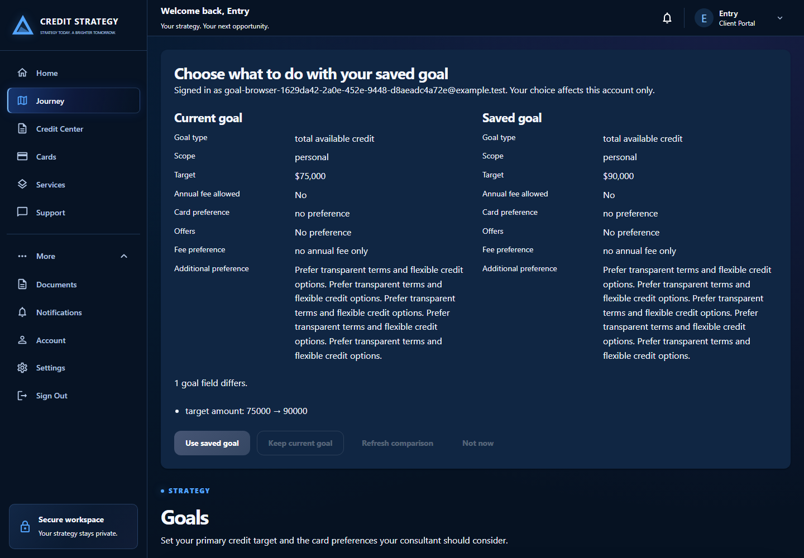

## decision-stale-mobile

Concurrent canonical edit requires a fresh explicit comparison

Route: /app/goals?intake=%5Bredacted%5D. Actor: 8fb3b2fd-1f30-4564-8ef7-5375acafd6fc. Viewport: 390×844. PNG: 390×3571. Commit: 83a2e82b01610d2d9e1967b314f05bfd93331474.

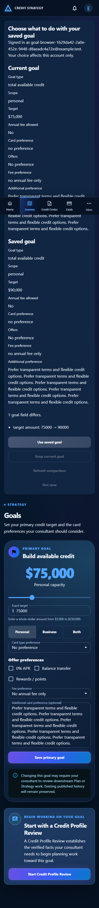

## uncertain-retry-desktop

Actual commit with response loss; only exact retry offered

Route: /app/goals?intake=%5Bredacted%5D. Actor: 8fb3b2fd-1f30-4564-8ef7-5375acafd6fc. Viewport: 1440×1000. PNG: 1440×1000. Commit: 83a2e82b01610d2d9e1967b314f05bfd93331474.

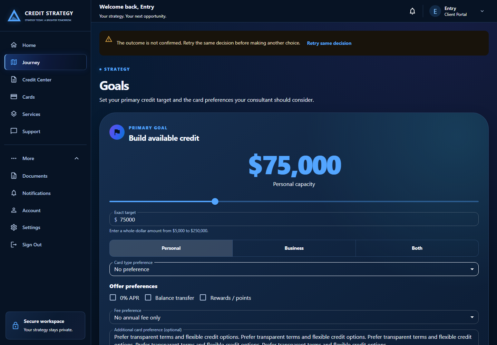

## uncertain-retry-mobile

Actual commit with response loss; only exact retry offered

Route: /app/goals?intake=%5Bredacted%5D. Actor: 8fb3b2fd-1f30-4564-8ef7-5375acafd6fc. Viewport: 390×844. PNG: 390×1821. Commit: 83a2e82b01610d2d9e1967b314f05bfd93331474.

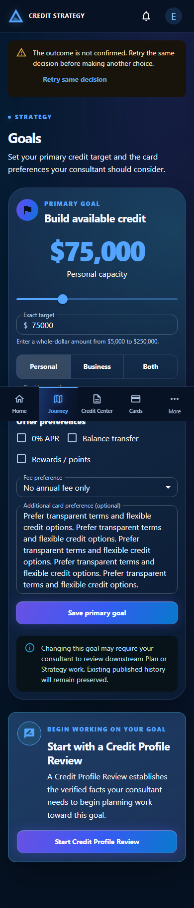

## retried-desktop

Exact retry returns original committed outcome

Route: /app/goals?intake=%5Bredacted%5D. Actor: 8fb3b2fd-1f30-4564-8ef7-5375acafd6fc. Viewport: 1440×1000. PNG: 1440×1000. Commit: 83a2e82b01610d2d9e1967b314f05bfd93331474.

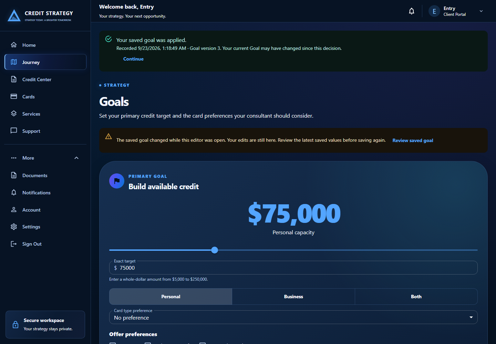

## retried-mobile

Exact retry returns original committed outcome

Route: /app/goals?intake=%5Bredacted%5D. Actor: 8fb3b2fd-1f30-4564-8ef7-5375acafd6fc. Viewport: 390×844. PNG: 390×2027. Commit: 83a2e82b01610d2d9e1967b314f05bfd93331474.

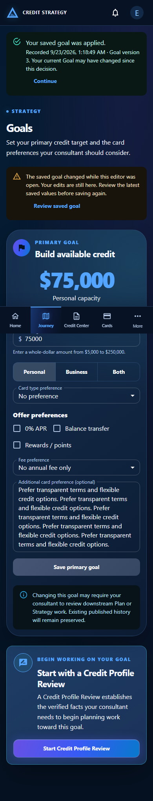

## decision-matching-desktop

Matching values; confirmation creates no Goal revision

Route: /app/goals?intake=%5Bredacted%5D. Actor: 8fb3b2fd-1f30-4564-8ef7-5375acafd6fc. Viewport: 1440×1000. PNG: 1440×1000. Commit: 83a2e82b01610d2d9e1967b314f05bfd93331474.

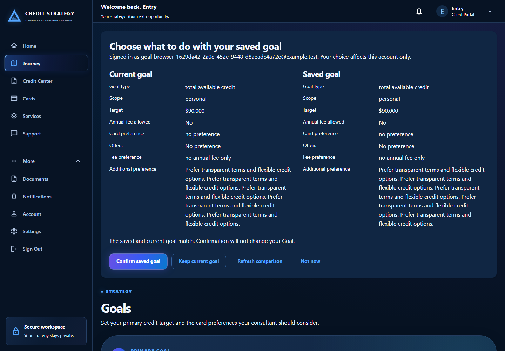

## decision-matching-mobile

Matching values; confirmation creates no Goal revision

Route: /app/goals?intake=%5Bredacted%5D. Actor: 8fb3b2fd-1f30-4564-8ef7-5375acafd6fc. Viewport: 390×844. PNG: 390×3547. Commit: 83a2e82b01610d2d9e1967b314f05bfd93331474.

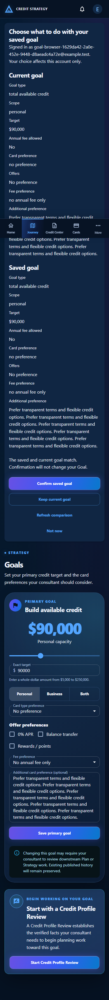

## expired-recovery-desktop

Authenticated recovery; no Goal mutation

Route: /app/goals?intake=%5Bredacted%5D. Actor: 8fb3b2fd-1f30-4564-8ef7-5375acafd6fc. Viewport: 1440×1000. PNG: 1440×1000. Commit: 83a2e82b01610d2d9e1967b314f05bfd93331474.

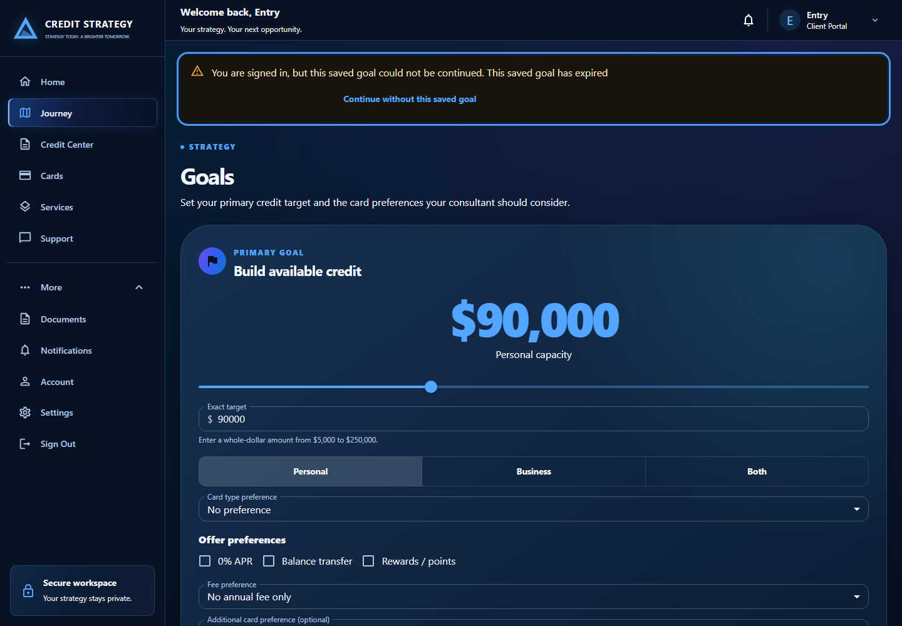

## expired-recovery-mobile

Authenticated recovery; no Goal mutation

Route: /app/goals?intake=%5Bredacted%5D. Actor: 8fb3b2fd-1f30-4564-8ef7-5375acafd6fc. Viewport: 390×844. PNG: 390×1864. Commit: 83a2e82b01610d2d9e1967b314f05bfd93331474.

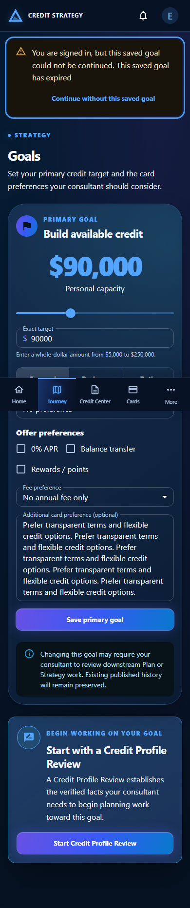

## storage-blocked-handoff-desktop

Real public save in same-origin iframe; storage denied; top-level auth preserves capability

Route: /register?intake=%5Bredacted%5D. Actor: anonymous. Viewport: 1440×1000. PNG: 1440×1149. Commit: 83a2e82b01610d2d9e1967b314f05bfd93331474.

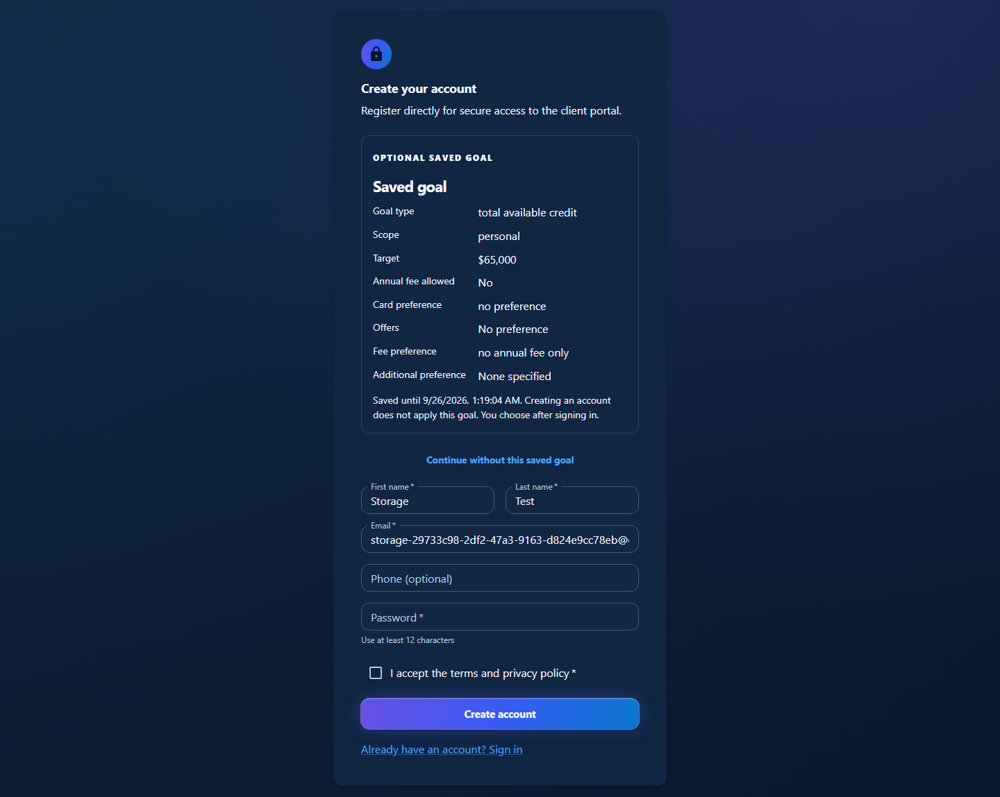

## storage-blocked-handoff-mobile

Real public save in same-origin iframe; storage denied; top-level auth preserves capability

Route: /register?intake=%5Bredacted%5D. Actor: anonymous. Viewport: 390×844. PNG: 390×1252. Commit: 83a2e82b01610d2d9e1967b314f05bfd93331474.

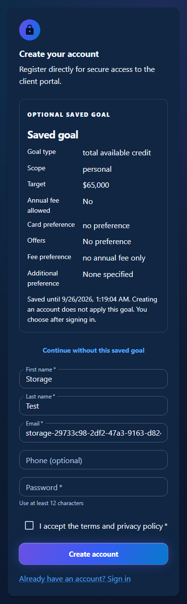
